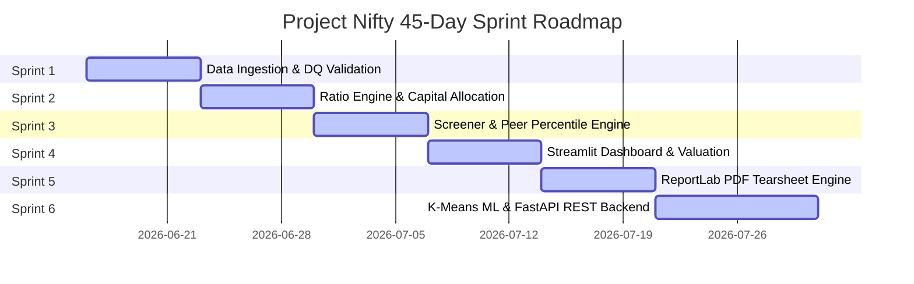

# 🏛️ Bluestock Nifty 100 Financial Intelligence Platform (Project Nifty)

[](https://bluestock-nifty-100-financial-intelligence-platform.streamlit.app/)
[](https://www.python.org/)
[](https://fastapi.tiangolo.com/)
[](https://www.sqlite.org/)
[](reports/pytest_report.html)

> **Live Application URL**: [https://bluestock-nifty-100-financial-intelligence-platform.streamlit.app/](https://bluestock-nifty-100-financial-intelligence-platform.streamlit.app/)

---

## 📌 Executive Summary

The **Bluestock Nifty 100 Financial Intelligence Platform (Project Nifty)** is an institutional-grade equity research, automated financial analytics, and interactive intelligence portal engineered during a 45-day intensive development roadmap. 

The platform processes, normalizes, validates, models, and visualizes over **11,000+ fundamental data points** across Income Statements (P&L), Balance Sheets, Cash Flow Statements, Market Capitalization, and BSE filings for **92 Nifty 100 index constituent companies** across a 10-year historical horizon (**FY2015 – FY2024**).

By integrating advanced financial ratio engines, machine learning clustering, natural language processing (NLP) pros/cons generators, valuation models, automated PDF tearsheet generation, and an interactive 8-screen dashboard, Project Nifty provides wealth managers, financial analysts, and investors with granular, data-driven equity insights.

---

## 🗓️ The 45-Day Project Nifty Development Journey

The platform was built sequentially over 6 structured Sprints spanning Days 1 to 45:



### 🔹 Sprint 1 (Days 1–7): Data Ingestion & Relational Database Architecture
* Ingested 7 core financial spreadsheets and 5 supporting datasets into a structured SQLite database (`data/nifty100.db`).
* Built a **16-rule Data Quality (DQ) Validator** (`DQ-01` to `DQ-16`) to catch negative sales, missing keys, date mismatches, and mathematical balance sheet discrepancies.
* Standardized 92 constituent company tickers and normalized 10-year financial dates into uniform `YYYY-MM` formats.

### 🔹 Sprint 2 (Days 8–14): Financial Ratio Engine & Capital Allocation Classifier
* Engineered a core KPI calculator computing 17 financial ratios (ROE, ROCE, OPM, NPM, D/E, ICR, FCF, Sales/PAT CAGR).
* Implemented the **8-Pattern Capital Allocation Matrix** classifying companies based on Cash Flow signs (CFO, CFI, CFF) into strategic corporate archetypes (*Reinvestors*, *Shareholder Returners*, *Debt-Funded Growth*, etc.).
* Formulated a **Winsorised Composite Quality Rating** ($0.30 \times \text{ROE} + 0.25 \times \text{FCF} + 0.25 \times \text{ROCE} + 0.20 \times \text{D/E}$).
* Developed an **Automated Column-Shift Auto-Healer** that dynamically detected and healed 88 misaligned spreadsheet entries.

### 🔹 Sprint 3 (Days 15–21): Screener & Peer Comparison Engine
* Built a dynamic analyst screener with 15 customizable financial thresholds and 6 strategy presets (*Quality Compounders*, *Value Picks*, *Growth Accelerators*, *Dividend Champions*, *Debt-Free Blue Chips*, *Turnaround Watch*).
* Developed an 11-industry peer percentile ranking engine utilizing `PERCENTRANK.INC` statistical distribution.
* Created 8-axis interactive Polar/Radar overlay charts comparing individual company scores against industry peer averages.

### 🔹 Sprint 4 (Days 22–28): Streamlit Analytics Dashboard & Valuation Module
* Built and deployed the multi-page Streamlit web platform featuring responsive sidebar navigation, interactive Plotly charts, and custom styled CSS tiles.
* Embedded Discounted Cash Flow (DCF) intrinsic valuation and relative valuation models (P/E, P/B, EV/EBITDA target multiples).
* Implemented an NLP-based Qualitative Pros & Cons rule engine evaluating financial health signals into structured strengths and concerns.

### 🔹 Sprint 5 (Days 29–35): Institutional Tearsheet & PDF Report Engine
* Built an automated PDF publishing pipeline combining ReportLab and Matplotlib graphics.
* Generated **89 individual company 2-page tearsheets**, **11 sector intelligence summaries**, and a **Master Portfolio Report PDF**.

### 🔹 Sprint 6 (Days 36–45): Machine Learning Clustering & FastAPI RESTful Backend
* Developed an unsupervised **K-Means Clustering model** categorizing companies into strategic financial clusters (validated via Elbow curves, Silhouette scores, and Pearson correlation heatmaps).
* Deployed a production-ready **FastAPI backend** (`src/api/main.py`) exposing 16 REST endpoints with strict NaN-to-null JSON compliance.
* Built a full automated unit and integration test suite featuring **124 passing test cases** (`pytest`).

---

## 🌐 Web Application Architecture (The 8 Portal Screens)

The live web portal ([bluestock-nifty-100-financial-intelligence-platform.streamlit.app](https://bluestock-nifty-100-financial-intelligence-platform.streamlit.app/)) provides an 8-screen workspace:

```
┌─────────────────────────────────────────────────────────────────────────────────┐
│                      Nifty 100 Financial Intelligence Portal                    │
├─────────────────────────────────────────────────────────────────────────────────┤
│  [1] Executive Overview   │ High-level KPIs, Sector Donut, Top-5 Quality Leaders│
│  [2] Company Explorer     │ 10-Yr Financial Trends, Dual-Axis Charts, Pros/Cons │
│  [3] Financial Screener   │ 10 Slider Metrics, 6 One-Click Presets, CSV Export  │
│  [4] Peer Comparison      │ Sector Matrices, Percentile Ranks, Polar Radar Plot │
│  [5] Trend Analysis       │ Multi-Metric YoY % Overlays, 10-Yr Historical Lines │
│  [6] Sector Analysis      │ 3D Bubble Chart (Sales vs ROE vs MCap), Sub-sectors │
│  [7] Capital Allocation   │ Interactive Plotly Treemap of 8 Corporate Archetypes│
│  [8] Annual Reports       │ Direct BSE India PDF Filing Repository (FY15-FY24)  │
└─────────────────────────────────────────────────────────────────────────────────┘
```

### 🏛️ Screen 1: Executive Overview
* **Portfolio Macro Metrics**: Highlights average portfolio ROE %, median P/E, median D/E, median 5-year Sales CAGR, total tracked constituents, and total debt-free blue chips.
* **Sector Distribution**: Interactive Plotly donut chart displaying the breakdown of Nifty 100 constituents across 11 broad sectors.
* **Quality Score Leaders**: Real-time leaderboards showcasing the top-ranked companies based on composite quality ratings.

### 📊 Screen 2: Company Explorer (Deep-Dive Profile)
* **Search & Auto-Complete**: Select any of the 92 constituent companies to inspect detailed financial profiles.
* **10-Year Trend Visualizations**: Dual-axis financial charts comparing Revenue vs. Net Profit trends alongside ROE vs. ROCE trajectory.
* **Qualitative Pros & Cons (NLP Engine)**: Rule-based natural language summary identifying fundamental strengths and risk warnings.

### 🔍 Screen 3: Interactive Financial Screener
* **10 Granular Metric Sliders**: Filter companies across ROE, D/E, FCF, Sales CAGR, PAT CAGR, OPM, P/E, P/B, ICR, and Quality Score.
* **6 Strategy Presets**: One-click execution of analyst screeners (*Quality Compounder*, *Value Pick*, *Growth Accelerator*, *Dividend Yield*, *Debt-Free*, *Turnaround*).
* **Export Capabilities**: Clean tabular output with instantaneous CSV downloading.

### 👥 Screen 4: Peer Group Comparison Portal
* **Industry Peer Matrix**: Side-by-side metric comparison across 11 distinct sector peer groups with gold star benchmark highlights.
* **Peer Percentile Rankings**: Relative percentile ranks evaluating individual company positioning within its industry group.
* **Polar Radar Chart Overlay**: Interactive 8-axis radar plot mapping constituent strengths relative to peer group averages.

### 📉 Screen 5: 10-Year Metric Trend Overlay
* **Multi-Metric Comparison**: Overlay multiple financial metrics (Sales, Profit, OPM %, ROE %, D/E, FCF) on a unified 10-year line graph.
* **YoY % Growth Annotations**: Real-time year-over-year growth percentage calculations and trend analysis.

### 🏢 Screen 6: Sector & Sub-sector Intelligence
* **3D Bubble Chart Visualization**: Maps Revenue (X-axis) against ROE % (Y-axis) with bubble size representing Market Capitalization and colors denoting sub-sectors.
* **Sub-Sector Summary Cards**: Sub-sector median ROE and Quality Score group summaries.

### 🌳 Screen 7: Capital Allocation Treemap
* **8-Pattern Treemap**: Interactive Plotly treemap grouping companies into 8 strategic allocation categories based on CFO, CFI, and CFF sign patterns:
  1. **Reinvestor** (`+ / - / -`)
  2. **Shareholder Returns** (`+ / - / -`)
  3. **Liquidating Assets** (`+ / + / -`)
  4. **Distress Signal** (`- / + / +`)
  5. **Growth Funded by Debt** (`+ / - / +`)
  6. **Cash Accumulator** (`+ / + / +`)
  7. **Pre-Revenue / Burn** (`- / - / +`)
  8. **Mixed / Transitional**
* **Pattern Filtering**: Filter and inspect corporate constituents belonging to specific capital management profiles.

### 📋 Screen 8: Annual Reports Finder
* **BSE Filings Repository**: Browse original BSE India Annual Report PDF links for all 92 companies across FY2015–FY2024.
* **Live HTTP Verification**: Validated links with browser headers to ensure immediate, error-free PDF downloads.

---

## 🧠 Core Methodologies & Mathematical Models

### 1. Winsorised Composite Quality Score
To evaluate company quality without distortion from extreme outliers, metrics are winsorised at the 10th ($P_{10}$) and 90th ($P_{90}$) percentiles:

$$\text{Quality Score} = 0.30 \times \text{ROE}_{\text{win}} + 0.25 \times \text{FCF}_{\text{win}} + 0.25 \times \text{ROCE}_{\text{win}} + 0.20 \times (1 - \text{DE}_{\text{win}})$$

### 2. Capital Allocation Matrix (Sign Analysis)
The platform evaluates capital flow directionality across cash flow components:

$$\text{Pattern} = f\Big(\text{sgn}(\text{CFO}), \text{sgn}(\text{CFI}), \text{sgn}(\text{CFF})\Big)$$

### 3. K-Means Unsupervised Clustering Archetypes
Standardized feature vectors ($\mathbf{x}_i \in \mathbb{R}^{10}$) are clustered using $K=4$ centroids, classifying companies into operational archetypes (*Quality Leaders*, *Capital Intensive Giants*, *High-Leverage Turnarounds*, *Moderate Performers*).

---

## 🔬 System Integrity & Testing

The platform enforces software reliability with **124 passing unit and integration test cases**:

```text
tests/api/test_companies_api.py   ....   [  3%]
tests/api/test_health_api.py      .      [  4%]
tests/api/test_screener_api.py    ..     [  5%]
tests/api/test_sectors_api.py     ...    [  8%]
tests/etl/test_loader.py          .......... [ 16%]
tests/etl/test_normalise.py       .......................................... [ 50%]
tests/etl/test_rules.py           ......... [ 57%]
tests/kpi/test_cagr.py             ....... [ 62%]
tests/kpi/test_cashflow.py         ....... [ 68%]
tests/kpi/test_leverage.py         ............ [ 78%]
tests/kpi/test_orchestration.py   ....   [ 81%]
tests/kpi/test_peer.py            ...    [ 83%]
tests/kpi/test_profitability.py    ............... [ 95%]
tests/kpi/test_screener.py        .....  [100%]

======================= 124 passed in 1.28s =======================
```

---

## 👨‍💻 Author & Credits

* **Developer**: Rishi Srivastava
* **Project**: Bluestock Internship — Project Nifty (45-Day Deliverable Challenge)
* **Live App**: [https://bluestock-nifty-100-financial-intelligence-platform.streamlit.app/](https://bluestock-nifty-100-financial-intelligence-platform.streamlit.app/)
* **GitHub Repository**: [https://github.com/Mercer18/Bluestock-Project-Nifty](https://github.com/Mercer18/Bluestock-Project-Nifty)
